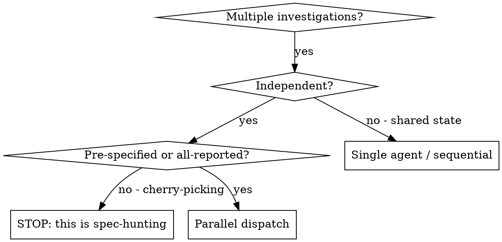

# Dispatching Parallel Investigations

## Overview

You delegate investigations to specialized agents with isolated context. By precisely crafting their instructions, you keep each focused and preserve your own context for synthesis. They never inherit your session history — you construct exactly what each needs.

When you have multiple independent investigations (different datasets, different sub-topics in a literature survey, different pre-specified robustness checks), running them sequentially wastes time. Each is independent and can run in parallel.

**Core principle:** One agent per independent investigation. Let them run concurrently, then synthesize.

## The Pre-Registration Guard (read first)

Parallelism multiplies researcher degrees of freedom. If you dispatch 20 specifications and report the one that "works," you have p-hacked at scale — parallelism made it faster, not more honest.

- **Pre-specified robustness checks are fine in parallel** — they were registered, and you report all of them.
- **Exploratory analyses are fine in parallel** — as long as every result is labeled exploratory and none is promoted to confirmatory.
- **Never** use parallel dispatch to search the specification space for significance and report the survivor.

## When to Use



**Use when:**
- Surveying several independent sub-topics of prior work
- Replicating one analysis across several independent datasets
- Running a pre-specified set of robustness/sensitivity checks (all reported)
- Investigating several independent anomalies with different root causes

**Don't use when:**
- The investigations share state or feed each other
- You'd be selecting which result to report based on what comes back

## The Pattern

### 1. Identify Independent Investigations
Group by what's being examined. Each must be understandable without the others.

### 2. Create Focused Agent Tasks
Each agent gets:
- **Specific scope:** one dataset, sub-topic, or check
- **Clear goal:** the question it must answer
- **Constraints:** for robustness checks, the exact pre-specified specification — not "find what works"
- **Expected output:** the result AND the method, so you can verify

### 3. Dispatch in Parallel
```
Task("Survey prior effect sizes for X in domain A")
Task("Survey known confounds for X")
Task("Replicate the primary model on dataset B, exact spec")
```

### 4. Synthesize and Verify
- Read each summary
- Verify results independently (don't trust "done")
- Report ALL pre-specified/robustness results together — including the ones that disagree
- Check for conflicts and reconcile

## Agent Prompt Structure

1. **Focused** — one investigation
2. **Self-contained** — all context to understand it, including the exact specification for a robustness check
3. **Specific about output** — the result, the method used, and enough to reproduce

```markdown
Replicate the primary model on dataset B.

Use EXACTLY this pre-registered specification (do not alter it to improve fit):
  outcome ~ exposure + age + site, OLS, exclude rows with missing exposure

Dataset B is at data/raw/site_b.csv (immutable). Set seed 20260528.
Validate the loaded shape, run the model, report:
  - the coefficient on exposure with 95% CI and p
  - N used and any rows excluded (with reason)
Do NOT try alternative specifications. Report this one result.
```

## Common Mistakes

- **Too broad:** "Analyze everything" -> agent flails. Give one scope.
- **No spec for robustness checks:** the agent improvises -> you've created forking paths. Specify exactly.
- **Trusting summaries:** verify each result against the committed output.
- **Reporting only the agreeable results:** report all pre-specified investigations, including disconfirming ones.

## Verification

After agents return:
1. Read each summary
2. Verify each result independently (`science-superpowers:verifying-results-before-claiming`)
3. Check for conflicts between investigations
4. Report the full set — agreements and disagreements alike

## Integration

- **science-superpowers:surveying-prior-work** — parallel literature survey
- **science-superpowers:subagent-driven-analysis** — single-investigation execution (sequential within one investigation)
- **science-superpowers:investigating-anomalous-results** — parallel investigation of independent anomalies
