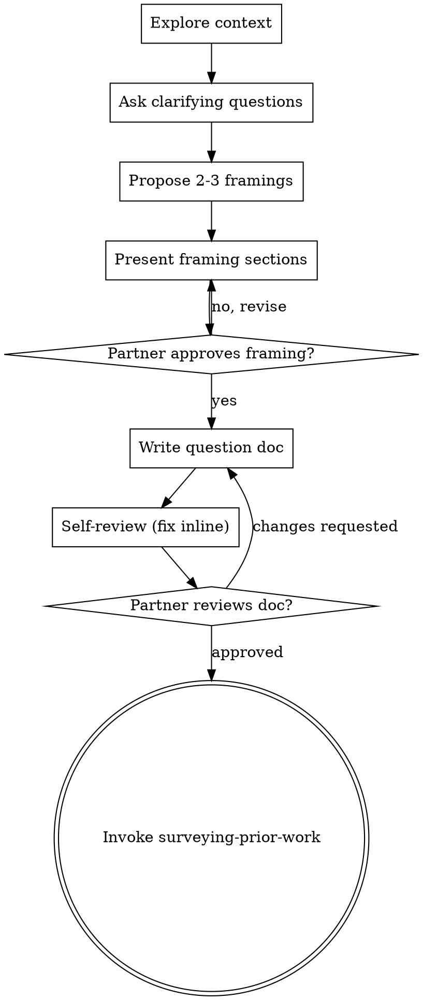

# Framing Research Questions Into Investigations

Help turn a fuzzy research interest into a precise, falsifiable question with explicit hypotheses, the data required, and what would count as an answer — through natural collaborative dialogue.

Start by understanding the context (the data on hand, the domain, what your human partner already knows), then ask questions one at a time to sharpen the interest. Once you understand what is being investigated, present the framing and get approval.

<HARD-GATE>
Do NOT load the dataset, compute any statistic, fit any model, plot any outcome, or invoke any execution skill until you have presented a research framing and your human partner has approved it. This applies to EVERY investigation regardless of perceived simplicity.

**Why this gate is strict for science specifically:** Looking at outcomes before the question and predictions are fixed contaminates a confirmatory analysis. Once you have seen the data, you cannot un-see it, and every later choice (which test, which subgroup, which cutoff) becomes suspect. Framing first is what keeps a result confirmatory rather than a story told after the fact.
</HARD-GATE>

## Anti-Pattern: "This Is Too Simple To Need Framing"

Every investigation goes through this process. A single t-test, a quick correlation, a "just look at the trend" — all of them. "Simple" questions are where unexamined assumptions and undeclared researcher degrees of freedom do the most damage. The framing can be short (a few sentences for a truly simple question), but you MUST present it and get approval.

## Checklist

You MUST create a task for each of these items and complete them in order:

1. **Explore context** — what data exists, its shape and provenance, the domain, recent related work in the repo
2. **Ask clarifying questions** — one at a time; understand the phenomenon, the population, the unit of analysis, and what decision the answer informs
3. **Propose 2-3 framings** — different ways to make the question precise, with trade-offs and your recommendation
4. **Present the framing** — question, hypotheses, data needed, success/answer criteria, scope; get approval after each section
5. **Write the question document** — save to `docs/science-superpowers/questions/YYYY-MM-DD-<topic>.md` and commit
6. **Self-review** — quick inline check for vagueness, unfalsifiable claims, undefined measures, scope creep (see below)
7. **Your human partner reviews the written framing** — ask them to review the file before proceeding
8. **Transition** — invoke surveying-prior-work to ground methods, then designing-the-analysis

## Process Flow



**The terminal state is invoking surveying-prior-work** (then designing-the-analysis). Do NOT jump to loading data or fitting models. The ONLY skills you invoke after framing are surveying-prior-work and designing-the-analysis.

## The Process

**Understanding the interest:**

- Inspect the context first: what data is available, its schema, size, and where it came from. You may look at *structure and provenance* (column names, row counts, collection method) — but do NOT look at outcome distributions or relationships you might later test.
- Before asking detailed questions, assess scope: if the request bundles several independent questions ("does the treatment work, and what drives churn, and can we forecast revenue"), flag it immediately. Decompose into separate investigations, each with its own question → design → pre-registration cycle.
- For appropriately-scoped interests, ask questions one at a time.
- Prefer multiple-choice questions when possible; open-ended is fine too.
- Only one question per message.
- Focus on: the phenomenon, the population/sample, the unit of analysis, the comparison, and what decision or understanding the answer serves.

**A good research question is:**

- **Specific** — names the variables, the population, and the relationship being examined
- **Falsifiable** — there is an outcome that would prove it wrong
- **Operationalized** — every construct maps to something measurable in the data ("engagement" → what column, computed how)
- **Scoped** — answerable with one coherent analysis, not five

**Exploring framings:**

- Propose 2-3 ways to make the question precise (e.g., association vs. causal effect; continuous outcome vs. threshold; population-level vs. subgroup).
- Lead with your recommended framing and explain the trade-offs (what each can and cannot conclude, what data each needs).

**Presenting the framing:**

- Once you understand the question, present it in sections scaled to complexity.
- Cover: the question, the hypotheses (including the null and a directional prediction if appropriate), the data and key variables, what would count as a confirmatory answer, and explicit scope/exclusions.
- Ask after each section whether it looks right.

## After the Framing

**Documentation** — write the approved framing to `docs/science-superpowers/questions/YYYY-MM-DD-<topic>.md`:

```markdown
# <Question title>

**Research question:** <one precise, falsifiable sentence>

**Background / motivation:** <why this matters, what decision it informs>

**Hypotheses:**
- H0 (null): <...>
- H1 (alternative, directional if justified): <...>

**Population & unit of analysis:** <who/what, the sample, the unit>

**Key variables (operationalized):**
- Outcome: <construct> → <measure / column / computation>
- Predictor(s) / exposure: <...> → <...>
- Covariates / potential confounders: <...>

**What counts as an answer:** <the confirmatory criterion, stated qualitatively here; exact decision rules come later in pre-registration>

**Scope & exclusions:** <what is explicitly out of scope>

**Open questions for prior-work survey:** <methods to check, known confounds to look up>
```

Commit the document to git.

**Self-Review** — look at the document with fresh eyes:

1. **Vagueness scan:** Any construct not mapped to a measure? Any "better", "improves", "related to" without specifying direction or magnitude? Fix them.
2. **Falsifiability:** Is there an outcome that would disconfirm H1? If not, reframe.
3. **Scope check:** Is this one investigation, or several wearing a trench coat? Decompose if needed.
4. **Unit/population clarity:** Is the unit of analysis unambiguous (person? session? cluster?)? Fix if not.

Fix issues inline. No need to re-review — just fix and move on.

**Partner Review Gate** — after the self-review passes:

> "Framing written and committed to `<path>`. Please review it and let me know if you want changes before we survey prior work and design the analysis."

Wait for the response. If they request changes, make them and re-run the self-review. Only proceed once they approve.

**Transition:**

- Invoke surveying-prior-work to ground the question and methods in existing knowledge.
- Then designing-the-analysis. Do NOT invoke any other skill or touch outcomes yet.

## Key Principles

- **One question at a time** — don't overwhelm
- **Falsifiable or it's not a question** — there must be an outcome that proves it wrong
- **Operationalize everything** — constructs must map to measures
- **YAGNI ruthlessly** — cut sub-questions that don't serve the decision
- **Don't peek** — structure and provenance are fair game; outcomes are not, until pre-registration is done
