# Pre-Registering the Analysis

## Overview

Write down the hypotheses, the exact analysis, the directional predictions, and the decision rules — and freeze them — *before* you look at the outcomes. Then run exactly that.

**Core principle:** If you decided the analysis after seeing the data, you cannot tell whether the data shaped the answer. A prediction is only evidence if it was made before the result.

**Violating the letter of this rule is violating the spirit of this rule.**

This is the pre-registration discipline — the science analog of test-driven development. In TDD you write the test before the code so you know the test tests something. Here you write the prediction before the result so you know the result confirms something.

## The Iron Law

```
NO CONFIRMATORY CLAIM WITHOUT A PRE-REGISTERED PREDICTION FIRST
```

Looked at the outcomes before locking the analysis? That analysis is now **exploratory**. You cannot relabel it confirmatory. To make a confirmatory claim, pre-register and test on data you have not yet used.

**No exceptions:**
- Don't "lightly" reorder the analysis after a peek
- Don't add the covariate that "obviously" should be there once you saw the result
- Don't move the cutoff to where it "works"
- Don't keep an unregistered analysis and call it confirmatory because "it would have been my prediction anyway"

Looked? It's exploratory. Period.

## When to Use

**Always, before:**
- Any hypothesis test you intend to report as confirmatory
- Any p-value, confidence interval, or effect estimate that will support a claim
- Loading or plotting the outcome variable in a way that reveals the relationship you'll test

**Exploratory work is allowed and valuable** — but it must be *labeled* exploratory and never dressed up as confirmation. Exploratory findings are hypotheses for the next pre-registration.

**Exceptions (decide with your human partner):**
- Purely descriptive reporting with no inferential claim
- Pure method development on simulated data
- Re-analysis of already-public results

Thinking "I'll just check the result first, then pre-register"? Stop. That's the rationalization this skill exists to stop.

## Lock — Execute — Separate

```dot
digraph prereg_cycle {
    rankdir=LR;
    lock [label="LOCK\nhypotheses, analysis,\npredictions, decision rules", shape=box, style=filled, fillcolor="#ffcccc"];
    falsifiable [label="Disconfirming\nresult specified?", shape=diamond];
    freeze [label="FREEZE\ncommit + timestamp", shape=box];
    execute [label="EXECUTE\nexactly as registered", shape=box, style=filled, fillcolor="#ccffcc"];
    separate [label="SEPARATE\nlabel anything else\nexploratory", shape=box, style=filled, fillcolor="#ccccff"];

    lock -> falsifiable;
    falsifiable -> freeze [label="yes"];
    falsifiable -> lock [label="no - unfalsifiable,\nreframe"];
    freeze -> execute;
    execute -> separate;
}
```



### LOCK — Write the prediction before the result

Specify, in writing:
- **Hypotheses:** H0 and a directional H1 where justified
- **The primary analysis:** the one model/test, the exact variables, transformations, covariates, exclusions
- **The prediction:** what you expect, with direction (and magnitude if the survey gave you one)
- **The decision rule:** the exact result that confirms vs. disconfirms — e.g., "confirm H1 if the coefficient on `exposure` is positive with p < .005 in the pre-specified model"
- **Stopping rule:** the sample size is fixed in advance; you will not peek-and-extend
- **Multiplicity plan:** how many tests, and the correction (so you don't harvest one "significant" result from twenty)
- **Secondary/exploratory analyses:** listed and labeled as such

### Verify it is falsifiable — the "watch it fail" step

A registration is only real if some possible result would disconfirm the prediction. State that result explicitly. If no result could disconfirm it, the prediction is unfalsifiable — reframe before freezing. This mirrors verifying a test fails for the right reason before trusting it.

### FREEZE — Make the timestamp real

Write the pre-registration to `docs/science-superpowers/preregistrations/YYYY-MM-DD-<topic>.md` and commit it to git **before** touching outcomes. The commit is your timestamp: it proves the prediction preceded the result.

### EXECUTE — Run exactly what you registered

Run the pre-registered analysis unchanged. Resist every "while I'm here" addition. The discipline of `science-superpowers:designing-the-analysis` and the validation-on-known-data steps apply here.

### SEPARATE — Confirmatory vs. exploratory, always distinguishable

Anything you do that was not registered — a follow-up, a subgroup, a different model — is exploratory. Report it under an "Exploratory" heading. Exploratory results are leads, not conclusions.

## Pre-Registration Template

```markdown
# Pre-registration: <topic>

**Frozen at commit:** <filled by the freeze commit>
**Question doc:** docs/science-superpowers/questions/<...>
**Analysis plan:** docs/science-superpowers/plans/<...>

## Hypotheses
- H0: <...>
- H1 (directional): <...>

## Primary analysis (exact)
- Model/test: <e.g., OLS: outcome ~ exposure + age + site>
- Variables & operationalizations: <...>
- Transformations: <...>
- Inclusion/exclusion criteria: <fixed now>
- Covariates: <fixed now>

## Prediction
- Direction: <sign>
- Expected magnitude (from prior work): <effect size + source, if available>

## Decision rule
- Confirm H1 if: <exact criterion>
- Disconfirm / null if: <exact criterion>

## Sample size & stopping
- N (fixed): <...> ; Power: <...> at alpha <...> for effect <...>
- No optional stopping. No peeking-and-extending.

## Multiplicity
- Number of confirmatory tests: <...>
- Correction: <e.g., Bonferroni / pre-specified primary only>

## Secondary & exploratory (labeled)
- <listed; reported separately, never as confirmatory>

## Planned deviations handling
- Any deviation will be documented in the report and renders the affected analysis exploratory.
```

## Why Order Matters

**"I'll just look at the data first, then write the prediction"**

A prediction written after seeing the result always "fits." That is HARKing — Hypothesizing After Results are Known. It feels like insight; it is circular. The data cannot test a hypothesis it generated.

**"I'll try a few specifications and report the one that works"**

That is p-hacking / the garden of forking paths. With enough analytic choices, a "significant" result is almost guaranteed by chance. Pre-specifying the one analysis removes the forking.

**"I'll keep collecting until it's significant"**

Optional stopping inflates false positives dramatically. Fix N in advance, or use a pre-specified sequential design with proper corrections.

**"Re-deriving the analysis with TDD-style discipline is wasteful, I already saw the answer"**

Sunk cost. The peeked analysis is exploratory — that's not waste, it's a lead. The cost of relabeling it "confirmatory" is a result you cannot trust and a finding that won't replicate.

**"Pre-registration is dogmatic; pragmatism means adapting to what the data shows"**

Pre-registration IS pragmatic: it is the difference between a finding that replicates and one that evaporates. Adapting to what the data shows is exactly the bias it prevents. Adapt in the *next* study, with a *new* pre-registration.

## Common Rationalizations

| Excuse | Reality |
|--------|---------|
| "Too simple to pre-register" | Simple analyses have forking paths too. Locking takes minutes. |
| "I'll register after a quick look" | A look makes it exploratory. The look is the violation. |
| "This covariate obviously belongs" | Add it to the registration *before* seeing the result, or it's a researcher degree of freedom. |
| "The cutoff that works is the right one" | Choosing a cutoff by its result is p-hacking. Fix it first. |
| "It would have been my prediction anyway" | Then writing it down first cost nothing. You didn't, so it's exploratory. |
| "Just one more specification" | One more fork. Pre-specify the primary; label the rest exploratory. |
| "Deleting the peeked analysis is wasteful" | Don't delete it — relabel it exploratory. Don't promote it to confirmatory. |
| "Stopping early since it's already significant" | Optional stopping inflates false positives. Honor the fixed N. |

## Red Flags - STOP and Re-frame

- Looking at the outcome distribution / the relationship before the registration is frozen
- Choosing the test, covariates, exclusions, or cutoff after seeing results
- Adding analyses because the first wasn't significant
- Extending the sample because p was "almost there"
- Reporting an unregistered result as confirmatory
- "It's about the spirit, this peek doesn't really count"
- "This is different because..."

**All of these mean: that analysis is exploratory. Pre-register a fresh confirmatory test on unused data.**

## Statistical Fallacies Reference

When specifying the analysis and decision rules, read @statistical-fallacies.md to avoid the traps pre-registration is designed to prevent: p-hacking, HARKing, the garden of forking paths, optional stopping, multiple comparisons, data leakage, overfitting, and p-value misinterpretation.

## Verification Checklist

Before executing:

- [ ] Hypotheses written, with a directional H1 where justified
- [ ] The primary analysis fully specified (model, variables, transforms, exclusions, covariates)
- [ ] A disconfirming result is stated explicitly (it is falsifiable)
- [ ] The decision rule is exact and result-independent
- [ ] Sample size fixed; no optional stopping
- [ ] Multiplicity handled
- [ ] Exploratory analyses listed and labeled
- [ ] Pre-registration committed to git BEFORE any outcome was observed

Can't check all boxes? You're not ready for a confirmatory claim.

## The Bottom Line

```
Confirmatory claim → prediction was registered and frozen first
Otherwise → it's exploratory, label it so
```

No exceptions without your human partner's permission.

## Handoff

Once frozen, set up the workspace and execute: use `science-superpowers:subagent-driven-analysis` (recommended) or `science-superpowers:executing-analysis`. Both invoke `science-superpowers:setting-up-reproducible-analysis` first.
