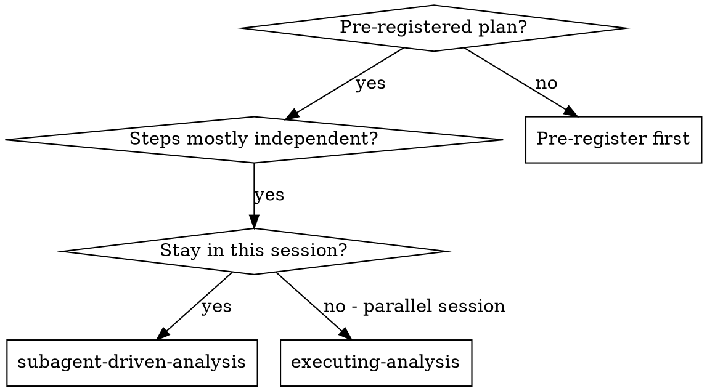
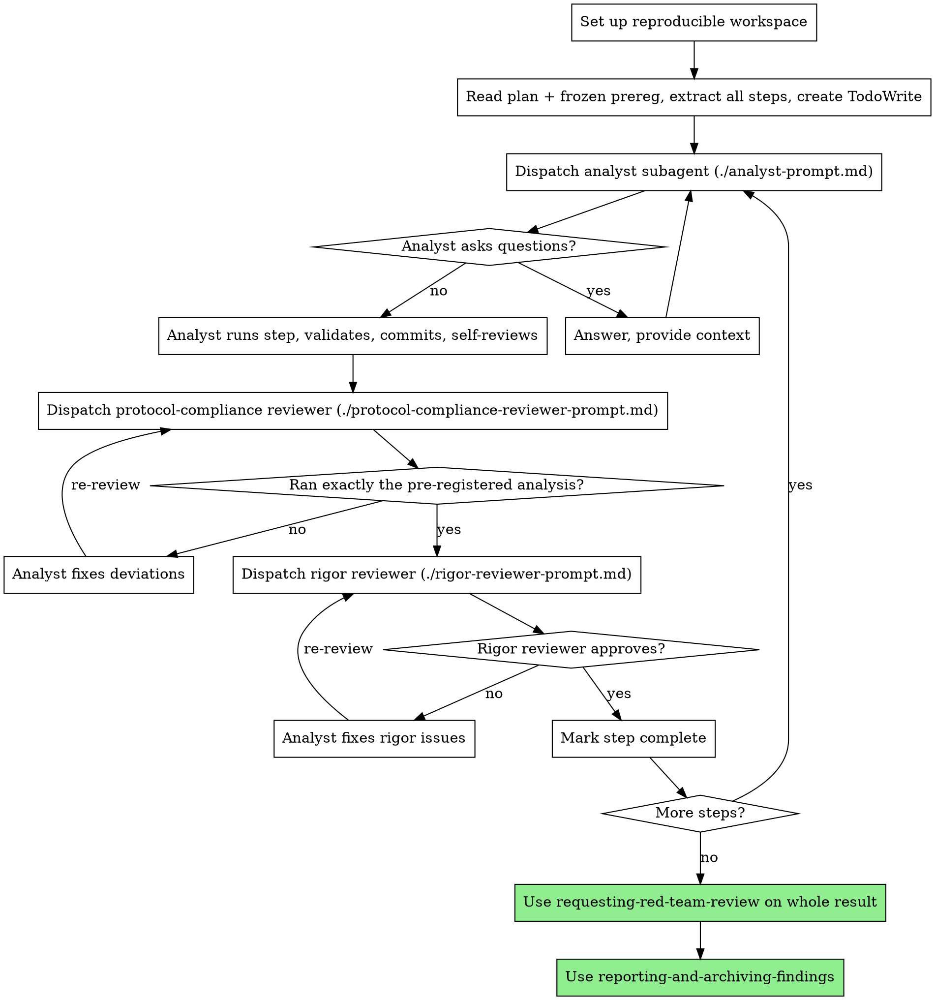

# Subagent-Driven Analysis

Execute a pre-registered analysis plan by dispatching a fresh subagent per analysis step, with two-stage review after each: protocol-compliance review first (did it run exactly what was pre-registered, nothing more), then statistical-rigor review (assumptions, leakage, correctness, reproducibility).

**Why subagents:** You delegate steps to specialized agents with isolated context. By precisely crafting their instructions, you keep them focused and prevent them from improvising analyses you didn't pre-register. They never inherit your session's history — you construct exactly what they need. This also preserves your own context for coordination.

**Core principle:** Fresh subagent per step + two-stage review (protocol then rigor) = trustworthy, reproducible results.

**Continuous execution:** Do not pause to check in between steps. Execute the whole plan. The only reasons to stop: a BLOCKED status you cannot resolve, an anomaly that needs `science-superpowers:investigating-anomalous-results`, a genuine ambiguity, or all steps complete.

## Prerequisite

The analysis plan MUST be pre-registered and frozen (`science-superpowers:preregistering-analysis`) before any step runs. If it is not frozen, stop and pre-register first. Executing before freezing turns the whole thing exploratory.

## When to Use

## The Process

## Model Selection

Use the least powerful model that can handle each role.

- **Mechanical steps** (load data, apply a fixed transform, produce a planned figure): fast, cheap model.
- **Integration/judgment steps** (fitting the primary model, handling missingness per plan): standard model.
- **Rigor review and anomaly judgment**: most capable model.

## Handling Analyst Status

**DONE:** Proceed to protocol-compliance review.

**DONE_WITH_CONCERNS:** Read the concerns. If about correctness or an unexpected data issue, address before review (may need `science-superpowers:investigating-anomalous-results`). If an observation ("this file is getting large"), note and proceed.

**NEEDS_CONTEXT:** Provide the missing information and re-dispatch.

**BLOCKED:** Assess. Context problem → provide more and re-dispatch. Needs more reasoning → more capable model. Step too large → split. Plan itself is wrong → escalate to your human partner. A wrong plan may require re-opening the pre-registration, which must be documented as a deviation.

**Never** silently let a subagent change the registered analysis to make a step "work." A deviation is documented and renders that analysis exploratory.

## Prompt Templates

- `./analyst-prompt.md` — dispatch the analyst subagent
- `./protocol-compliance-reviewer-prompt.md` — did it match the pre-registration?
- `./rigor-reviewer-prompt.md` — is the statistics correct, reproducible, leak-free?

## Red Flags

**Never:**
- Execute before the pre-registration is frozen
- Skip either review (protocol OR rigor)
- Let a subagent add an unregistered analysis and report it as confirmatory
- Run rigor review before protocol compliance is green (wrong order)
- Accept a silently dropped outlier or changed cutoff (route to anomaly investigation instead)
- Dispatch multiple analyst subagents on the same artifacts in parallel (conflicts)
- Make the subagent read the whole plan (provide the step's full text + the relevant pre-registration excerpt)

**If a reviewer finds issues:** the same analyst subagent fixes them, then the reviewer reviews again. Repeat until approved.

## Integration

**Required workflow skills:**
- **science-superpowers:setting-up-reproducible-analysis** — isolated, seeded, reproducible workspace (run first)
- **science-superpowers:preregistering-analysis** — must be frozen before execution
- **science-superpowers:investigating-anomalous-results** — when a step's output is surprising or impossible
- **science-superpowers:requesting-red-team-review** — adversarial review of the whole result
- **science-superpowers:reporting-and-archiving-findings** — after all steps complete

**Subagents should use:**
- **science-superpowers:verifying-results-before-claiming** — before any subagent reports a step as done

**Alternative:**
- **science-superpowers:executing-analysis** — inline execution for harnesses without subagents
