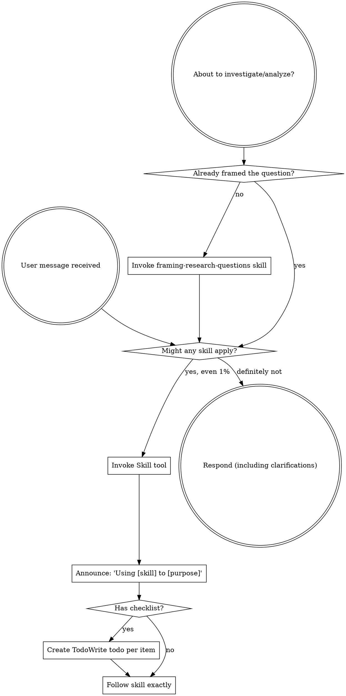

<SUBAGENT-STOP>
If you were dispatched as a subagent to execute a specific task, skip this skill.
</SUBAGENT-STOP>

<EXTREMELY-IMPORTANT>
If you think there is even a 1% chance a skill might apply to what you are doing, you ABSOLUTELY MUST invoke the skill.

IF A SKILL APPLIES TO YOUR TASK, YOU DO NOT HAVE A CHOICE. YOU MUST USE IT.

This is not negotiable. This is not optional. You cannot rationalize your way out of this.
</EXTREMELY-IMPORTANT>

## Instruction Priority

Science Superpowers skills override default system prompt behavior, but **your human partner's instructions always take precedence**:

1. **Your human partner's explicit instructions** (CLAUDE.md, GEMINI.md, AGENTS.md, direct requests) — highest priority
2. **Science Superpowers skills** — override default system behavior where they conflict
3. **Default system prompt** — lowest priority

If CLAUDE.md, GEMINI.md, or AGENTS.md says "skip pre-registration" and a skill says "always pre-register," follow your human partner's instructions. They are in control.

## How to Access Skills

**In Claude Code:** Use the `Skill` tool. When you invoke a skill, its content is loaded and presented to you—follow it directly. Never use the Read tool on skill files.

**In Copilot CLI:** Use the `skill` tool. Skills are auto-discovered from installed plugins. The `skill` tool works the same as Claude Code's `Skill` tool.

**In Gemini CLI:** Skills activate via the `activate_skill` tool. Gemini loads skill metadata at session start and activates the full content on demand.

**In Google Antigravity:** Skills are Antigravity Agent Skills (same `SKILL.md` format). Antigravity equips a skill automatically when your request matches its `description`. The always-on bootstrap rule keeps the discipline active from the first message, before any skill is equipped. See `references/antigravity-tools.md`.

**In Pi:** Skills are discovered natively (same `SKILL.md` format) and listed in your system prompt; when a task matches, `read` the skill's `SKILL.md` and follow it. Pi also exposes each skill as a `/skill:name` command. The bootstrap extension keeps the discipline active from the first message. Pi ships without sub-agents and a to-do tool — see `references/pi-tools.md`.

**In other environments:** Check your platform's documentation for how skills are loaded.

## Platform Adaptation

Skills use Claude Code tool names. Non-CC platforms: see `references/copilot-tools.md` (Copilot CLI), `references/codex-tools.md` (Codex), `references/antigravity-tools.md` (Google Antigravity), `references/pi-tools.md` (Pi) for tool equivalents. Gemini CLI users get the tool mapping loaded automatically via GEMINI.md.

# Using Skills

## The Rule

**Invoke relevant or requested skills BEFORE any response or action.** Even a 1% chance a skill might apply means that you should invoke the skill to check. If an invoked skill turns out to be wrong for the situation, you don't need to use it.

## Red Flags

These thoughts mean STOP—you're rationalizing:

| Thought | Reality |
|---------|---------|
| "This is just a quick data peek" | A peek can poison a confirmatory analysis. Check for skills first. |
| "I need to look at the data first" | Skills tell you WHEN looking is safe. Check first. |
| "This is just a simple question" | Questions are tasks. Check for skills. |
| "Let me just run the analysis" | Skills tell you HOW to run it honestly. Check first. |
| "I'll frame the question after I explore" | Framing comes BEFORE exploration. Check first. |
| "This doesn't need a formal skill" | If a skill exists, use it. |
| "I remember this skill" | Skills evolve. Read current version. |
| "This doesn't count as a task" | Action = task. Check for skills. |
| "The skill is overkill" | Simple analyses become p-hacked papers. Use it. |
| "I'll just do this one thing first" | Check BEFORE doing anything. |
| "This feels productive" | Undisciplined action produces unreproducible results. Skills prevent this. |
| "I know what that means" | Knowing the concept ≠ using the skill. Invoke it. |

## Skill Priority

When multiple skills could apply, use this order:

1. **Process skills first** (framing-research-questions, investigating-anomalous-results) - these determine HOW to approach the task
2. **Execution skills second** (designing-the-analysis, subagent-driven-analysis) - these guide carrying it out

"Let's investigate X" → framing-research-questions first, then execution skills.
"This result looks wrong" → investigating-anomalous-results first.

## Skill Types

**Rigid** (pre-registration, anomaly investigation, verification): Follow exactly. Don't adapt away discipline.

**Flexible** (patterns): Adapt principles to context.

The skill itself tells you which.

## User Instructions

Instructions say WHAT, not HOW. "Analyze X" or "Check whether Y" doesn't mean skip workflows.
